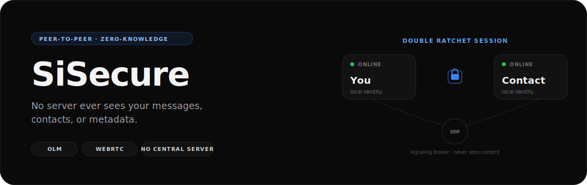
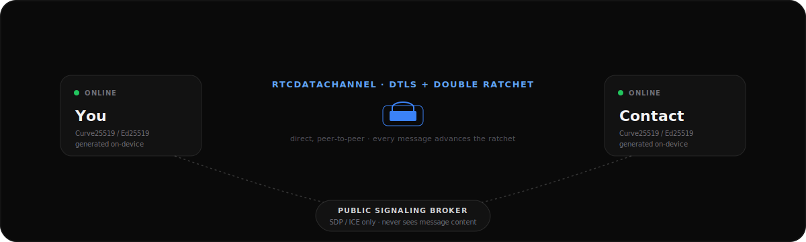

<p align="center">
  
</p>

<p align="center">
  
  
  
  
  
</p>

---

## What is this

SiSecure is a messaging app built on one premise: the service provider should have **zero knowledge, zero access, and zero metadata** about who you talk to or what you say. There is no backend database of messages, no account server, no contact directory. Every message travels directly between two devices over a WebRTC data channel, encrypted with a real [Double Ratchet](https://signal.org/docs/specifications/doubleratchet/) session that only the sender and recipient can decrypt.

If SiSecure's infrastructure disappeared tomorrow, your conversations wouldn't — they were never there to begin with.

## Features

- **Local identity, no phone number or email.** A Curve25519/Ed25519 keypair is generated on-device at signup. That's your entire account.
- **Contact requests.** Contacts are added by scanning a QR code or entering a public key directly. A new contact starts `pending` — receiving your key isn't enough to message you, you have to accept the request first.
- **Safety-number verification.** Every conversation has a fingerprint derived from both parties' identity keys. Compare it out-of-band and mark a contact verified to confirm no one intercepted the key exchange.
- **Real end-to-end encryption.** Every 1:1 conversation runs its own [Olm](https://gitlab.matrix.org/matrix-org/olm) Double Ratchet session (the same cryptographic library Matrix/Element use in production). Group chats use Megolm, with session keys distributed individually over each member's pairwise encrypted channel.
- **Direct P2P transport.** Messages travel over `RTCDataChannel`, peer to peer. A public signaling broker is used only to help two devices find each other and negotiate the connection — it never sees a single byte of message content.
- **Groups.** Encrypted group chats with membership management and automatic key rotation when members are added.
- **Temp Rooms.** Disposable, link-shareable group chats with no identity and no persistence — a random AES-256 key lives only in the URL fragment, which browsers never send to any server. Closing the tab destroys the room.
- **Rich messaging.** Text, images, voice notes, reactions, read receipts, typing indicators, message forwarding — all encrypted, all local.
- **Presence without a server.** Online/offline status is derived from live peer connections, not a centralized presence service.
- **PIN lock and encrypted local vault.** An optional PIN derives an AES-256-GCM key (via PBKDF2) that encrypts your identity, sessions, and message history at rest — without it, IndexedDB on disk is unreadable, including to anyone with direct access to the device.
- **Tiered data nuke, with auto-nuke on inactivity.** Wipe just message history, or everything except your identity, in one action — optionally triggered automatically after a configurable number of idle days.

## How it works

<p align="center">
  
</p>

1. **Identity.** On first launch, SiSecure generates a local Ed25519/Curve25519 keypair (via Olm) plus a set of one-time prekeys — entirely on-device.
2. **Contact exchange.** Scanning a contact's QR code (or entering their key manually) hands your device their public routing address. The two devices then open a direct WebRTC connection.
3. **Handshake.** The moment that connection opens, both sides exchange their Olm identity key and a one-time prekey — bootstrapping a Double Ratchet session with zero extra round trips.
4. **Messaging.** Every message is encrypted with that session before it ever leaves the device. Each message advances the ratchet, so compromising one message's key doesn't expose the rest of the conversation.
5. **Groups.** The first time you send into a group, a Megolm session key is generated and delivered to each member individually, encrypted through your pairwise session with them — the same key-distribution pattern used by Matrix.

## Tech stack

| Layer | Choice |
|---|---|
| UI | React 19 + Vite + Tailwind CSS 4 |
| Local storage | Dexie (IndexedDB) |
| P2P transport | WebRTC via PeerJS (public broker for signaling only) |
| Encryption | [`@matrix-org/olm`](https://gitlab.matrix.org/matrix-org/olm) — Double Ratchet + Megolm |
| Local vault encryption | Web Crypto API — PBKDF2 → AES-256-GCM, key derived from your PIN |
| QR code | `qrcode.react` (generate) / `html5-qrcode` (scan) |
| Animation | Motion |

## Getting started

**Prerequisites:** Node.js 18+

```bash
npm install
npm run dev
```

The app runs at `http://localhost:3000`. Open it in two different browsers (or two devices on the same network) to test messaging between two identities — each browser's IndexedDB is its own independent local identity, exactly as it would be on two separate phones.

Other scripts:

```bash
npm run build     # production build
npm run preview   # preview the production build locally
npm run lint      # type-check (tsc --noEmit)
```

## Docker

Static build served via nginx. A GitHub Actions workflow (`.github/workflows/docker-publish.yml`) builds and pushes the image to GHCR on every push to `main` and on `v*.*.*` tags.

```bash
# Build from this directory
docker compose up -d

# Or pull the prebuilt image instead of building
docker compose -f docker-compose.ghcr.yml up -d
```

The build-from-source variant publishes to `http://localhost:8080`. The GHCR variant only `expose`s port 80 on the compose network (no host port mapping) — put it behind your own reverse proxy, or add a `ports:` mapping back in `docker-compose.ghcr.yml` if you want to hit it directly. First-time GHCR publishes sometimes default to a private package even on a public repo — if the pull is denied, set the package's visibility to public from the repo's Packages tab on GitHub.

## Project structure

```
src/
├── SiSecureContext.tsx   # Core state: identity, contacts, P2P transport, encryption
├── lib/
│   ├── db.ts             # Dexie schema (profile, contacts, messages, groups, sessions)
│   ├── olm.ts            # Olm WASM initialization
│   ├── crypto.ts         # Double Ratchet / Megolm session management
│   ├── vault.ts          # PIN-derived vault key, at-rest encryption
│   ├── safetyNumber.ts   # Fingerprint derivation for contact verification
│   ├── tempCrypto.ts     # Shared-key AES-GCM for Temp Rooms
│   └── utils.ts
└── components/
    ├── Onboarding.tsx        # Local identity creation
    ├── Home.tsx              # App shell
    ├── ChatList.tsx          # Conversation list, contact requests, unread indicators
    ├── ChatView.tsx          # Message thread, composer, media
    ├── AddContactModal.tsx   # QR generation/scanning, manual key entry
    ├── VerifyContactModal.tsx  # Safety-number comparison
    ├── UnlockScreen.tsx      # PIN entry, gates the app before the vault key exists
    ├── TempRoomView.tsx      # Ephemeral, unpersisted group chat
    ├── CreateGroupModal.tsx
    ├── GroupInfoModal.tsx
    └── SettingsModal.tsx     # Backup export/import, PIN vault, nuke tiers
```

## Security notes

- Message content and media are encrypted before they leave the device. A signaling broker is used only to help two peers discover each other and negotiate a WebRTC connection (SDP/ICE) — it never has access to plaintext or ciphertext message content.
- With the PIN vault enabled, identity, sessions, and message history are also encrypted at rest — without the PIN, none of it is readable from the device's storage either.
- Encrypted local backups are protected with a user-supplied passphrase (AES) — the passphrase never leaves your device either.
- This project is under active development. Treat it as a strong technical foundation, not yet an audited production security product — see open items below before relying on it for high-stakes threat models.

**Known limitations:**
- The WebRTC signaling identity (used to route connections) isn't cryptographically bound to the Olm identity key. Safety-number verification closes this gap, but it's a manual, opt-in step — verify new contacts out-of-band if your threat model includes an adversary on the signaling path.
- No TURN relay beyond the public broker's shared fallback; connections across some restrictive networks may be unreliable.
- **Delivery requires overlapping online time.** Since there's no store-and-forward server, a message only reaches its recipient once both of you happen to have the app open at the same moment. If you send while they're offline and then close the app yourself before they return, nothing is left running anywhere to retry it — it waits for the next coincidence. This is inherent to a serverless P2P design, not a bug.

## Roadmap

- **Wake Up** (button already in the UI, not yet functional). Directly addresses the delivery gap above: a one-tap ping that prompts a peer to open SiSecure even if their browser is fully closed — no message content, nothing added to chat history. There's no way to reach a fully-closed app without the browser's own Push service, so this requires the Web Push API plus a small relay server whose only job is forwarding an opaque wake ping. That server never sees message content, but it does see a push subscription and roughly when a wake was sent — a deliberate, disclosed, **opt-in-only** exception to SiSecure's zero-server design. Everything else about the app stays exactly as it is today.
- Multi-device sync and self-destructing messages are also planned, not yet implemented.

## License

Not yet licensed for external use.
